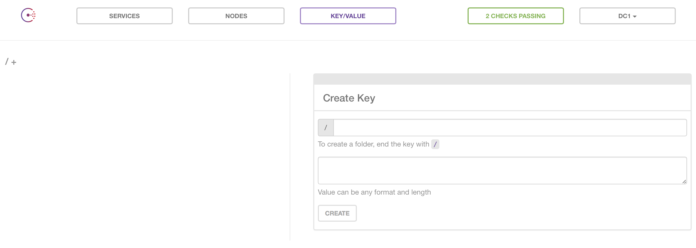

# Extra exercises

!SLIDE
## Inject key-value pairs as Environment Variable

!SUB
Install essentials for environment variables

```
FROM xebia/consul-dns
RUN wget --no-check-certificate https://github.com/hashicorp/envconsul/releases/download/v0.5.0/envconsul_0.5.0_linux_amd64.tar.gz
RUN tar -zxvf envconsul_0.5.0_linux_amd64.tar.gz
RUN ls
RUN chmod 755 ./envconsul_0.5.0_linux_amd64
CMD /opt/consul agent -data-dir /tmp/consul -config-dir /opt/config/ -client 0.0.0.0 -bind 0.0.0.0 > /var/consul.log & bash
```
!SUB

Run the container and join the cluster

!SUB
Set key-value pairs using the HTTP API
```
curl -X PUT -d 'myvalue' http://localhost:8500/v1/kv/web/mykey
```

!SUB
Install web ui

```
FROM xebia/consul-dns
RUN wget --no-check-certificate https://dl.bintray.com/mitchellh/consul/0.5.0_web_ui.zip
RUN mkdir ui
RUN unzip 0.5.0_web_ui.zip -d /opt/ui
RUN rm 0.5.0_web_ui.zip
CMD /opt/consul agent -data-dir /tmp/consul -config-dir /opt/config/ -ui-dir /opt/ui/dist -client 0.0.0.0 -bind 0.0.0.0 > /var/consul.log & bash
```

!SUB
Run web ui and expose port and join the cluster

```
docker $RUN -p 8500:8500 xebia/consul-ui
consul join {IP of one of cluster members}
```

!SUB
Now you can also set key-value pairs using the Consul web ui at http://192/168.59.103:8500
 <!-- .element: class="noborder" -->
[consul.io/intro/getting-started/ui](http://www.consul.io/intro/getting-started/ui.html)


!SUB
See the key/values in /web translated to environment variables
```
./envconsul web env
```

!SUB
See the restarting of your "application" in case of updates
```
envconsul web /bin/sh -c "env; echo "-----"; sleep 1000"
```
Go back to consul-env container and check the changes you make in the UI


!SLIDE
## DIY
Build & run a mongodb image

!SLIDE
## DIY
Connect `hellowebworld` to MongoDB using Consul

!SUB
Install essentials:

```
{
  "builders": [
    {
      "type": "docker",
      "image": "consul:dns",
      "export_path": "consul-python.tar",
      "pull": false
    }
  ],
  "provisioners": [
    {
      "type": "shell",
      "inline": [
        "apt-get -y install python",
        "wget https://bootstrap.pypa.io/get-pip.py",
        "python get-pip.py",
        "pip install pymongo"
      ]
    },
    {
      "type": "file",
      "source": "config/",
      "destination": "/opt/config/"
    },
    {
      "type": "file",
      "source": "ws.py",
      "destination": "/opt/ws.py"
    }
  ]
}
```

!SLIDE
## DIY

Perform health checks on each service

!SLIDE
## DIY

Configure HAProxy as a load balancer using Consul

[hashicorp.com/blog/haproxy-with-consul](http://hashicorp.com/blog/haproxy-with-consul.html)
